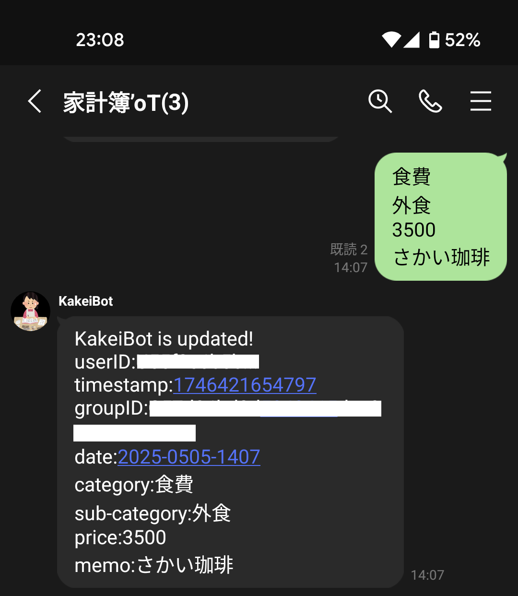

# KakeiBot

LINE Messagning APIとAWS Lambdaを組み合わせて家計簿アプリを作成しています。

## 概要

- 所定のフォーマットに従ってLINEのBotに出費を記録すると、LINE Messaging API経由でAWS lambdaの処理が呼び出されAWS DynamoDBに登録される、という仕組みです
- 毎週既定の時間帯(月曜の朝など)には前の週の出費や収入をLINEに通知します

<!-- Insert image -->
出費の記録

毎週の出費の記録

## ライセンス

このプロジェクトはMITライセンスのもとで公開されています。

## 参考文献
- [LINE Messaging APIの使い方](https://note.com/tomisan/n/ne5d7fbd55507)
- [LINE Developers](https://developers.line.biz/ja/)
- [ボットを作成する](https://developers.line.biz/ja/docs/messaging-api/building-bot/)
- [ユーザーIDの取得](https://developers.line.biz/ja/docs/messaging-api/getting-user-ids/#page-title)
- [LINEのWebhook入門](https://lineapiusecase.com/ja/api/webhook.html)
- [AWS×LINE Messaging APIで家計簿を作ってみた①](https://zenn.dev/tn_a/articles/649c57463de040)
