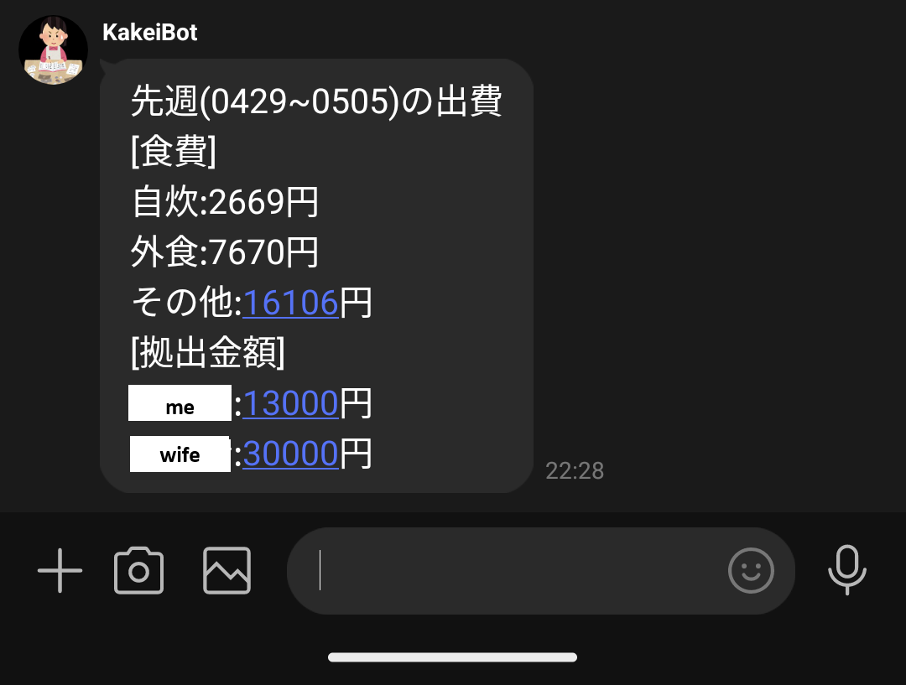

# KakeiBot

LINE Messagning APIとAWS Lambdaを組み合わせて家計簿アプリを作成しています。

---

## 概要
KakeiBotは、LINEメッセージ（テキスト・画像）を受け取り、家計簿データをDynamoDBに保存し、必要に応じて応答や集計を行うアプリケーションです。

<!-- Insert image -->

出費の記録 

 毎週の出費の記録 

---

## シーケンス図（Mermaid）

---

## 主な処理の流れ

### 1. テキストメッセージ処理
- ユーザーがLINEでテキストを送信
- Lambda関数がテキストからカテゴリ、金額等を抽出
- DynamoDBに保存
- 応答を返信

### 2. 画像メッセージ処理
- ユーザーがレシート画像を送信
- Lambda関数が画像を取得
- Azureの画像解析APIで日本語テキスト、金額、日付等を抽出
- DynamoDBに保存
- 応答を返信

### 3. 週次レポート
- 別のLambda関数が週に一度自動実行（EventBridgeでスケジュール）
- DynamoDBから一週間分のデータを集計
- LINEグループにサマリーを送信

---

## ライセンス

このプロジェクトはMITライセンスのもとで公開されています。

## 参考文献
- [LINE Messaging APIの使い方](https://note.com/tomisan/n/ne5d7fbd55507)
- [LINE Developers](https://developers.line.biz/ja/)
- [ボットを作成する](https://developers.line.biz/ja/docs/messaging-api/building-bot/)
- [ユーザーIDの取得](https://developers.line.biz/ja/docs/messaging-api/getting-user-ids/#page-title)
- [LINEのWebhook入門](https://lineapiusecase.com/ja/api/webhook.html)
- [AWS×LINE Messaging APIで家計簿を作ってみた①](https://zenn.dev/tn_a/articles/649c57463de040)
